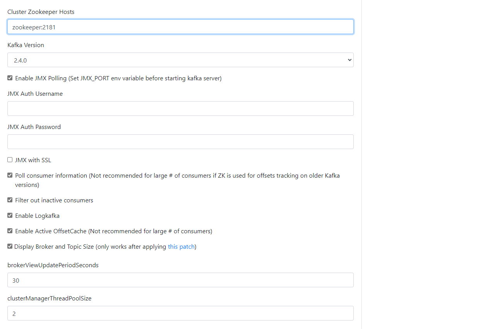
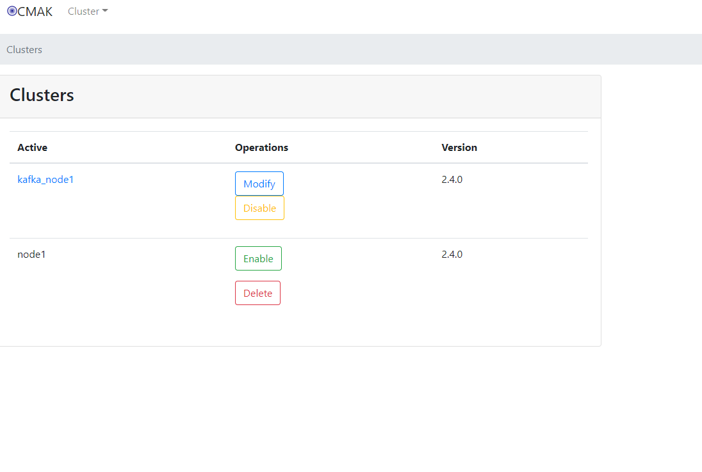

# docker-kafka

## 开始
* 修改配置
```shell
# 进入根目录,执行下面命令，需要修改.env 里面的自己的host
cp .env.example .env 
cp docker-compose.example.yml docker-compose.yml
```
* 启动容器
```shell
#执行下面命令（会构建镜像和启动容器）
docker-compose up 
```
* 使用
在项目里面填写在.env里面填写的host和端口


## 管理后台
* 配置
```shell
# 按顺序执行下面命令
docker exec -it zookeeper bash
./bin/zkCli.sh
ls /kafka-manager
create /kafka-manager/mutex ""
create /kafka-manager/mutex/locks ""
create /kafka-manager/mutex/leases ""

```
* 登陆地址 host:5000
```shell
# 访问地址：  本地host:5000
# 比如：http://192.168.240.120:5000/
```
* 后台添加集群



* 重启docker-kafka的所有服务

* 配置参考地址[CMAK_issues](https://github.com/yahoo/CMAK/issues/731)
* 后台添加集群参考地址[后台添加集群](https://www.jianshu.com/p/1dc1d3d59500)